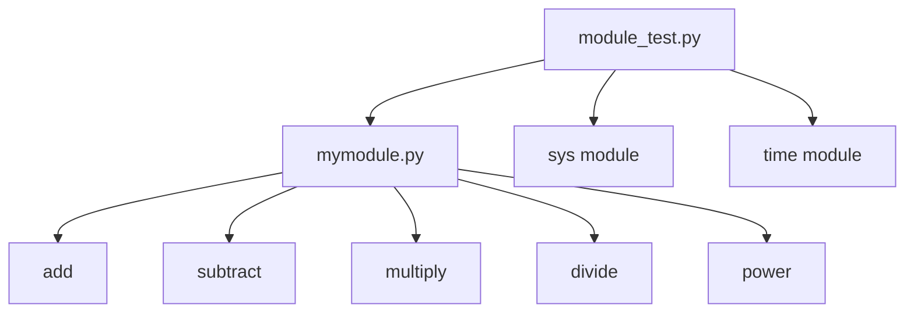

# Python Module
- 아래는 mymodule.py와 module_test.py를 기반으로 한 클래스 없는 모듈 구조 설명


## 📦 Python 모듈 구조 설명
### 🔹 모듈이란?
- 모듈(Module)은 함수, 변수, 클래스 등 Python 구성 요소들을 하나의 .py 파일에 모아놓은 것입니다. 
- 이를 통해 코드 재사용성과 구조화된 개발이 가능해집니다.

### 🧮 mymodule.py 구성
```python
# 사칙연산 함수 정의
def add(x, y):
    return x + y

def subtract(x, y):
    return x - y

def multiply(x, y):
    return x * y

def divide(x, y):
    return x / y

def power(x, y):
    return x ** y

# 모듈 직접 실행 시 동작
if __name__ == "__main__":
    print('-' * 5)
    print('called! __main__')
    print(add(5, 5))
    print(subtract(15, 5))
    print(multiply(5, 5))
    print(divide(10, 2))
    print(power(5, 3))
    print('-' * 5)
```
- `__name__ == "__main__"` 조건은 해당 파일이 직접 실행될 때만 코드가 실행되도록 합니다.  
- 다른 파일에서 import할 경우 이 부분은 실행되지 않습니다.

## 🧪 module_test.py 구성
```python
import sys
import time
import mymodule

# 현재 시스템 모듈 경로 확인
print(sys.path)

# 사용자 모듈 경로 추가
sys.path.append('/Users/jeongjunghwan/PycharmProjects/MyModule')

# mymodule 함수 사용
print(mymodule.add(5, 10))     # 15
print(mymodule.divide(5, 2))   # 2.5
```

- sys.path.append()를 통해 Python이 모듈을 찾을 수 있는 경로를 추가합니다.  
- 이후 import mymodule로 사용자 정의 모듈을 불러올 수 있습니다.


## 🔗 Module 관계도
- 아래는 module_test.py가 mymodule.py를 어떻게 참조하는지 보여주는 다이어그램입니다:


## ✅ 요약
- mymodule.py: 함수 정의 및 테스트용 실행 코드 포함
- module_test.py: 외부 모듈을 import하여 기능 사용
- sys.path: 사용자 모듈 경로를 추가하여 import 가능하게 함
- `__name__ == "__main__"`: 모듈의 직접 실행 여부 판단

---


