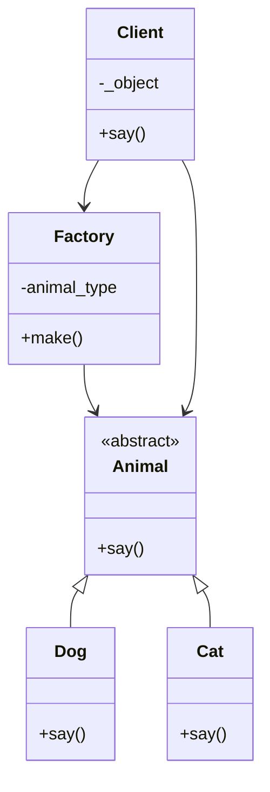

# Factory Pattern
**팩토리 패턴 (Factory Pattern)** 의 전형적인 구조를 설명.   
아래에 팩토리 패턴의 개념, 실무 활용, 코드 분석, Mermaid 다이어그램까지 정리.

## 🏭 팩토리 패턴이란?
팩토리 패턴은 객체 생성 로직을 클라이언트 코드에서 분리하여, 객체 생성 책임을 별도의 Factory 클래스에 위임하는 디자인 패턴.

## ✅ 목적
- 객체 생성 로직을 캡슐화
- 클라이언트는 어떤 클래스가 생성되는지 몰라도 됨
- 코드 확장성과 유지보수성 향상

### 🧠 실무에서 왜 쓰는가?

| 상황 또는 목적             | 설명                                                                 |
|----------------------------|----------------------------------------------------------------------|
| 조건문 제거 (`if/switch`)   | 다양한 객체 생성 시 조건문 없이 Factory로 분기 처리 가능                 |
| 객체 생성 책임 분리         | 클라이언트 코드에서 객체 생성 로직을 분리하여 코드 가독성 및 유지보수 향상 |
| 확장성 확보                | 새로운 클래스 추가 시 Factory만 수정하면 되므로 클라이언트 코드 변경 없음   |
| 테스트 용이성              | Factory를 Mock으로 대체하면 테스트 시 객체 생성 제어가 쉬워짐             |
| 의존성 역전(DIP) 적용       | 클라이언트가 구체 클래스가 아닌 추상 인터페이스에 의존하도록 유도           |


🧪 코드 구조 분석
```python
import abc

# 추상 클래스 정의
class Animal(abc.ABC):
    @abc.abstractmethod
    def say(self):
        pass

# 구체 클래스
class Dog(Animal):
    def say(self):
        return "Dog"

class Cat(Animal):
    def say(self):
        return "Cat"

# 팩토리 클래스
class Factory:
    def __init__(self, animal_type):
        self.animal_type = animal_type
    def make(self):
        return eval(self.animal_type)()  # 문자열 기반 생성 (주의 필요)

# 클라이언트
class Client:
    def __init__(self, animal_type):
        self._object = Factory(animal_type).make()
    def say(self):
        return self._object.say()

```

## ⚠️ 실무 개선 포인트
- eval()은 보안상 위험 → dict 기반 매핑으로 개선 추천:
```python
class Factory:
    registry = {
        "Dog": Dog,
        "Cat": Cat
    }
    def __init__(self, animal_type):
        self.animal_type = animal_type
    def make(self):
        return self.registry[self.animal_type]()
```


📊 Mermaid 다이어그램



## 실제 코드
```python
import abc

class Animal(abc.ABC):
    @abc.abstractmethod
    def say(self):
        pass

class Dog(Animal):
    def say(self):
        return "Dog"

class Cat(Animal):
    def say(self):
        return "Cat"

class Factory:
    def __init__(self, animal_type):
        self.animal_type = animal_type
    def make(self):
        return eval(self.animal_type)()

class Client:
    def __init__(self, animal_type):
        self._object = Factory(animal_type).make()
    def say(self):
        return self._object.say()

d = Client("Dog")
print(d.say())
'''Dog'''

c = Client("Cat")
print(c.say())
'''Cat'''


```
