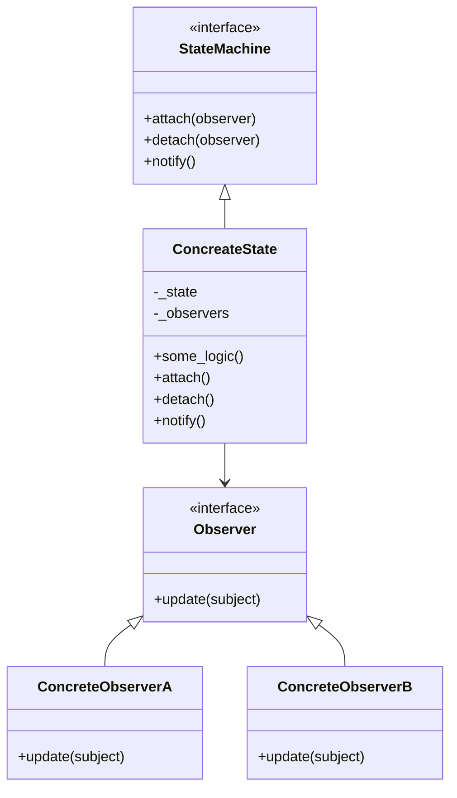

# Observer Pattern
**옵저버 패턴 (Observer Pattern)** 패턴의 취지, 사용법, 실무 활용, 코드 설명, Mermaid 다이어그램까지 정리.

## 👁️ 옵저버 패턴이란?
옵저버 패턴은 객체의 상태 변화가 있을 때, 그 변화를 **자동으로 감지하고 반응하는 객체들(옵저버)**에게 알림을 보내는 디자인 패턴.
## ✅ 핵심 개념
- Subject (주체): 상태를 갖고 있으며, 옵저버를 등록/해제/알림
- Observer (관찰자): 상태 변화에 반응하는 객체
- 의존성 역전(DIP): Subject는 Observer의 인터페이스만 알고 있음

## 🧠 취지와 사용 목적
| 목적 또는 상황             | 설명                                                                 |
|----------------------------|----------------------------------------------------------------------|
| 상태 변화 자동 반영         | 주체 객체의 상태가 바뀌면 등록된 옵저버들이 자동으로 반응함               |
| 느슨한 결합 구조            | 주체와 옵저버가 인터페이스로만 연결되어 있어 확장성과 유지보수성이 뛰어남   |
| 이벤트 기반 시스템 구현     | GUI, 게임, 실시간 처리 등에서 이벤트 감지 및 반응에 적합                   |
| 다중 구독자 처리            | 여러 옵저버가 하나의 주체를 동시에 감시할 수 있어 유연한 구조 설계 가능     |
| 관심사 분리                 | 상태 관리와 반응 로직을 분리하여 코드의 명확성과 재사용성을 높임           |


## 🧪 코드 구조 설명
```python
class StateMachine(ABC):  # Subject 인터페이스
    def attach(self, observer): pass
    def detach(self, observer): pass
    def notify(self): pass

class ConcreateState(StateMachine):  # 실제 상태 객체
    def __init__(self):
        self._state = 0
        self._observers = []

    def attach(self, observer):  # 옵저버 등록
        self._observers.append(observer)

    def detach(self, observer):  # 옵저버 해제
        self._observers.remove(observer)

    def notify(self):  # 상태 변화 알림
        for observer in self._observers:
            observer.update(self)

    def some_logic(self):  # 상태 변경 로직
        self._state = randrange(0, 10)
        self.notify()

class Observer(ABC):  # 옵저버 인터페이스
    def update(self, subject): pass

class ConcreteObserverA(Observer):  # 옵저버 A
    def update(self, subject):
        if subject._state <= 9:
            print("Observer A : execute")

class ConcreteObserverB(Observer):  # 옵저버 B
    def update(self, subject):
        if subject._state == 0 or subject._state == 2:
            print("Observer B : execute")
```


## 📊 Mermaid 다이어그램


## 🧠 실무에서 어떻게 쓰이나?
| 분야 또는 상황             | 활용 예시                                                              |
|----------------------------|------------------------------------------------------------------------|
| GUI 이벤트 처리            | 버튼 클릭, 입력 변화 등 사용자 인터랙션에 따라 UI 자동 업데이트             |
| 게임 개발                  | 캐릭터 상태 변화 → UI, 사운드, AI 반응                                 |
| 실시간 데이터 처리          | 센서 값 변화 → 알림, 로깅, 자동 제어                                    |
| 모델-뷰-컨트롤러(MVC) 구조 | 모델의 상태 변화 → 뷰 자동 업데이트                                     |
| 메시지 브로커 시스템        | Kafka, RabbitMQ 등에서 이벤트 발생 시 여러 소비자에게 알림 전달             |


## 전체 코드
```python
from abc import ABC, abstractmethod
from random import randrange

class StateMachine(ABC):
    @abstractmethod
    def attach(self, observer):
        pass
    @abstractmethod
    def detach(self, observer):
        pass
    @abstractmethod
    def notify(sel):
        pass

class ConcreateState(StateMachine):
    def __init__(self):
        self._state = 0
        self._observers = []

    def attach(self, observer):
        print("observer attach")
        self._observers.append(observer)

    def detach(self, observer):
        print("observer detach")
        self._observers.remove(observer)

    def notify(self):
        print("observer notify")
        for observer in self._observers:
            observer.update(self)

    def some_logic(self):
        print("some_logic")
        self._state = randrange(0, 10)
        print(f"state {self._state}")
        self.notify()

class Observer(ABC):
    @abstractmethod
    def update(self, subject):
        pass

class ConcreteObserverA(Observer):
    def update(self, subject):
        if subject._state <= 9:
            print("Observer A : execute")

class ConcreteObserverB(Observer):
    def update(self, subject):
        if subject._state == 0 or subject._state == 2:
            print("Observer B : execute")


state = ConcreateState()

observerA = ConcreteObserverA()

observerB = ConcreteObserverB()

state.attach(observerA)
'''observer attach'''

state.attach(observerB)
'''observer attach'''

state.some_logic()
'''
some_logic
state 0
observer notify
Observer A : execute
Observer B : execute
'''

state.detach(observerB)
'''observer detach'''

state.some_logic()
'''
some_logic
state 1
observer notify
Observer A : execute
'''

```

---
