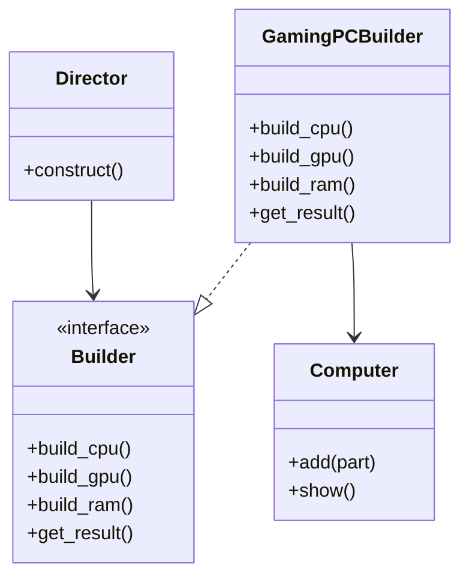

## 🧱 Build 패턴이란?
- 목적: 복잡한 객체의 생성 과정을 분리하여, 동일한 생성 절차로 서로 다른 표현을 만들 수 있게 함
- 주요 구성 요소:
  - Builder: 객체 생성에 필요한 단계 정의 (인터페이스)
  - ConcreteBuilder: Builder 인터페이스를 구현하여 실제 객체 생성
  - Director: Builder를 사용하여 객체 생성 순서를 지시
  - Product: 최종적으로 생성되는 객체

## 🐍 Python 
```python
# Product
class Computer:
    def __init__(self):
        self.parts = []

    def add(self, part):
        self.parts.append(part)

    def show(self):
        print("Computer Parts:")
        for part in self.parts:
            print(f" - {part}")

# Builder Interface
class Builder:
    def build_cpu(self): pass
    def build_gpu(self): pass
    def build_ram(self): pass
    def get_result(self): pass

# Concrete Builder
class GamingPCBuilder(Builder):
    def __init__(self):
        self.computer = Computer()

    def build_cpu(self):
        self.computer.add("Intel Core i9")

    def build_gpu(self):
        self.computer.add("NVIDIA RTX 4090")

    def build_ram(self):
        self.computer.add("32GB DDR5")

    def get_result(self):
        return self.computer

# Director
class Director:
    def __init__(self, builder: Builder):
        self.builder = builder

    def construct(self):
        self.builder.build_cpu()
        self.builder.build_gpu()
        self.builder.build_ram()
```
```python
# 사용 예시
builder = GamingPCBuilder()
director = Director(builder)
director.construct()
pc = builder.get_result()
pc.show()
```

### 🖥️ 출력 결과:
```
Computer Parts:
 - Intel Core i9
 - NVIDIA RTX 4090
 - 32GB DDR5
```


## 🧠 언제 사용하나요?
- 객체 생성이 복잡하고 여러 단계로 나뉘는 경우
- 동일한 생성 절차로 다양한 객체 구성이 필요한 경우
- 생성 로직과 표현 로직을 분리하고 싶을 때

## 🗺️ Build 패턴 다이어그램

---


