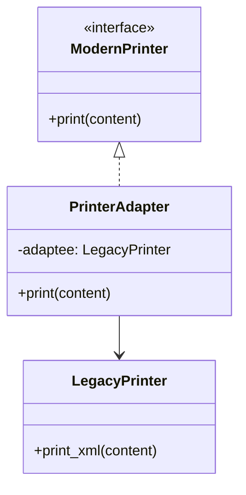

# Adapter 패턴
Adapter 패턴은 서로 호환되지 않는 인터페이스를 연결해주는 디자인 패턴으로,  
기존 클래스를 수정하지 않고 새로운 인터페이스에 맞게 사용할 수 있도록 도와줍니다.

## 🔌 Adapter 패턴이란?
Adapter 패턴은 기존 클래스의 인터페이스를 클라이언트가 기대하는 다른 인터페이스로 변환합니다.
즉, 호환되지 않는 인터페이스 간의 중재자 역할을 하여 기존 코드를 수정하지 않고 재사용할 수 있게 합니다.

## 🧠 이 예제에서의 역할
| 역할       | 클래스          | 메서드/기능               |
|------------|------------------|----------------------------|
| Target     | ModernPrinter    | print()                    |
| Adaptee    | LegacyPrinter    | print_xml()                |
| Adapter    | PrinterAdapter   | ModernPrinter + LegacyPrinter |
| Client     | main()           | ModernPrinter 인터페이스 사용 |


## 🖨️ 작동 흐름
- 클라이언트는 ModernPrinter 인터페이스를 기대합니다.
- 기존에 print_xml()만 지원하는 LegacyPrinter가 있습니다.
- PrinterAdapter가 ModernPrinter를 상속받고, 내부에 LegacyPrinter를 포함하여 print() 호출을 print_xml()로 위임합니다.
- 클라이언트는 adapter.print(...)만 호출하면 됩니다.

## 🐍 Python 예제
```python
class LegacyPrinter:
    def print_xml(self, content):
        print(f"<xml>{content}</xml>")

class ModernPrinter:
    def print(self, content):
        raise NotImplementedError

class PrinterAdapter(ModernPrinter):
    def __init__(self, adaptee):
        self.adaptee = adaptee

    def print(self, content):
        self.adaptee.print_xml(content)

def main():
    legacy = LegacyPrinter()
    adapter = PrinterAdapter(legacy)
    adapter.print("Hello, Adapter Pattern!")

if __name__ == "__main__":
    main()
```

## 🗺️ 클래스 다이어그램


## ✅ 요약
- Adapter 패턴은 기존 클래스를 수정하지 않고 새로운 인터페이스에 맞춰 사용할 수 있게 해줍니다.
- 이 예제에서는 LegacyPrinter를 ModernPrinter처럼 사용할 수 있게 해주는 중간 계층이 PrinterAdapter입니다.
- 실무에서는 레거시 시스템 통합, 라이브러리 래핑, API 호환성 유지 등에 자주 사용됩니다.

---

