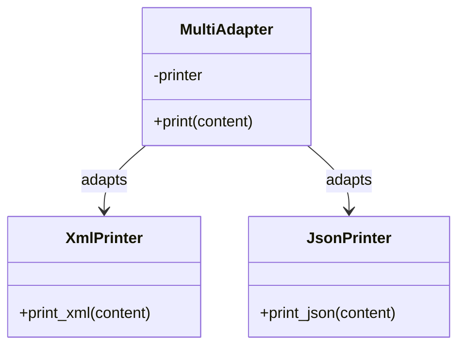

# 🧠 Multi Adapter 패턴 설명

## 🔍 핵심 아이디어
- 다양한 형식의 출력기(XmlPrinter, JsonPrinter)가 서로 다른 메서드명을 사용하지만,
- MultiAdapter는 런타임에 hasattr()로 메서드 존재 여부를 확인하고 적절한 메서드를 호출합니다.
- Python의 동적 타이핑 덕분에 인터페이스 없이도 유연하게 어댑터를 구현할 수 있습니다.
  
## ✅ 장점
- 다양한 형식의 프린터를 하나의 어댑터로 처리 가능
- 새로운 프린터 타입이 추가되어도 hasattr() 조건만 추가하면 확장 가능

## ⚠️ 단점
- 런타임 오류 가능성 (메서드 오타, 존재하지 않는 메서드 등)
- 타입 안정성이 낮음 (정적 타입 언어에서는 컴파일 타임에 잡히는 오류가 런타임까지 감춰짐)

## 🐍 Python 예제
```python
class XmlPrinter:
    def print_xml(self, content):
        print(f"<xml>{content}</xml>")

class JsonPrinter:
    def print_json(self, content):
        print(f'{{"content": "{content}"}}')

class MultiAdapter:
    def __init__(self, printer):
        self.printer = printer

    def print(self, content):
        if hasattr(self.printer, "print_xml"):
            self.printer.print_xml(content)
        elif hasattr(self.printer, "print_json"):
            self.printer.print_json(content)

def main():
    xml = XmlPrinter()
    json = JsonPrinter()

    adapter1 = MultiAdapter(xml)
    adapter2 = MultiAdapter(json)

    adapter1.print("Hello XML")
    adapter2.print("Hello JSON")

if __name__ == "__main__":
    main()

```

## 🗺️ Python MultiAdapter 클래스 다이어그램

---
# hasattr

hasattr는 Python 내장 함수로, 클래스나 객체에 특정 속성(변수나 메서드)이 존재하는지를 런타임에 확인할 수 있게 해줍니다.  
하지만 hasattr은 클래스에 자동으로 **함수 이름을 속성으로 등록** 해주는 건 아닙니다.  
대신, Python은 클래스의 메서드나 속성을 객체의 속성(attribute) 으로 취급하기 때문에 hasattr()로 확인이 가능.

## 🔍 예시로 이해해보기
```python
class MyClass:
    def greet(self):
        print("Hello")

obj = MyClass()

print(hasattr(obj, "greet"))  # ✅ True
print(hasattr(obj, "print"))  # ❌ False
```
- hasattr(obj, "greet")는 MyClass에 greet() 메서드가 정의되어 있으므로 True를 반환합니다.
- hasattr(obj, "print")는 해당 객체에 print()라는 메서드가 없기 때문에 False를 반환합니다.

## ✅ 핵심 요약

| 기능     | 예시                            |
|----------|---------------------------------|
| hasattr  | hasattr(obj, "메서드이름")       |
| getattr  | getattr(obj, "메서드이름")       |
| callable | callable(getattr(obj, "메서드이름", None)) |

---


