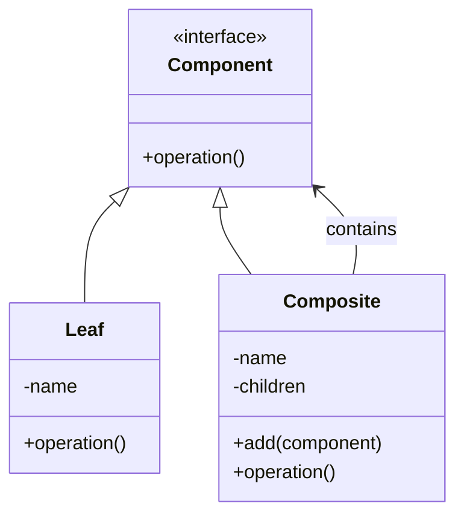

## 🌳 Composite 패턴이란?
Composite 패턴은 객체들을 트리 구조로 구성하여, 부분-전체 계층 구조를 표현할 수 있게 해주는 구조 디자인 패턴입니다.  
클라이언트는 개별 `객체(Leaf)` 와 `복합 객체(Composite)` 를 동일한 방식으로 처리할 수 있습니다.

## 🧠 이 예제에서의 역할

| 역할       | 클래스     | 주요 기능 또는 메서드     |
|------------|------------|---------------------------|
| Component  | Component  | operation() (인터페이스)  |
| Leaf       | Leaf       | operation() 구현          |
| Composite  | Composite  | operation(), add()        |
| Client     | main()     | Leaf와 Composite 사용     |


## 🔁 작동 흐름
- Leaf는 실제 작업을 수행하는 단일 객체입니다.
- Composite는 여러 Component(Leaf 또는 다른 Composite)를 자식으로 가질 수 있습니다.
- operation()을 호출하면, Composite는 자신의 이름을 출력하고 자식들에게 재귀적으로 operation()을 위임합니다.
- 클라이언트는 Leaf와 Composite를 구분하지 않고 Component 인터페이스만 사용합니다.

## 🐍 Python 예제

```python
class Component:
    def operation(self):
        raise NotImplementedError

class Leaf(Component):
    def __init__(self, name):
        self.name = name

    def operation(self):
        print(f"Leaf: {self.name}")

class Composite(Component):
    def __init__(self, name):
        self.name = name
        self.children = []

    def add(self, component):
        self.children.append(component)

    def operation(self):
        print(f"Composite: {self.name}")
        for child in self.children:
            child.operation()

def main():
    leaf1 = Leaf("Leaf 1")
    leaf2 = Leaf("Leaf 2")

    composite1 = Composite("Composite A")
    composite1.add(leaf1)
    composite1.add(leaf2)

    leaf3 = Leaf("Leaf 3")
    root = Composite("Root")
    root.add(composite1)
    root.add(leaf3)

    root.operation()

if __name__ == "__main__":
    main()
```

## 🗺️ Composite 패턴 클래스 다이어그램

## ✅ 장점
- 트리 구조를 재귀적으로 표현 가능
- 클라이언트 코드가 단순해짐 (Leaf와 Composite를 동일하게 다룸)
- 구조 확장에 유연함 (새로운 Composite 또는 Leaf 타입 추가 용이)

## ⚠️ 주의점
- 너무 일반화하면 모든 객체가 Composite가 될 수 있어 설계가 복잡해질 수 있음
- 자식 관리(add/remove 등)를 강제하지 않으면 Leaf에서도 호출 가능해질 수 있음

- 이 패턴은 GUI 구성 요소, 파일 시스템, 조직도, 수학식 트리 등  
  계층적 구조를 표현하는 모든 곳에서 매우 유용하게 사용됩니다.

---

