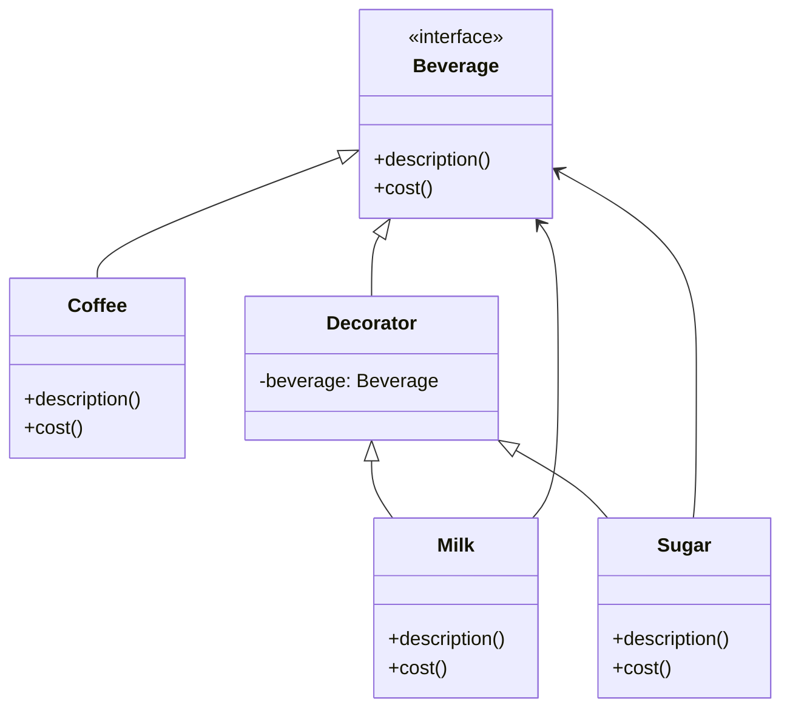

## 🎁 Decorator 패턴이란?
Decorator 패턴은 기존 객체의 구조를 변경하지 않고 기능을 동적으로 추가할 수 있도록 해주는 디자인 패턴입니다.  
기본 객체를 감싸는 `래퍼(wrapper)` 객체를 계층적으로 쌓아가며 기능을 확장합니다.

## 🧠 이 예제에서의 역할

| 역할       | 클래스       | 설명                                 |
|------------|--------------|--------------------------------------|
| Component  | Beverage     | 기본 인터페이스: description(), cost() |
| Concrete   | Coffee       | 기본 기능을 제공하는 실제 객체        |
| Decorator  | Decorator    | Beverage를 상속하고 내부에 Beverage 포함 |
| 확장 데코레이터 | Milk, Sugar | 기능을 확장하는 데코레이터 클래스     |
| Client     | main()       | 데코레이터를 조합하여 객체 생성 및 사용 |


## ☕ 작동 흐름
- Coffee는 기본 음료입니다.
- Milk와 Sugar는 Decorator를 상속받아 Beverage를 감싸고 기능을 확장합니다.
- main()에서는 Coffee 객체를 생성한 후, Milk와 Sugar로 감싸며 기능을 추가합니다.
- 최종적으로 description()과 cost()는 계층적으로 호출되어 누적된 결과를 반환합니다.


## 🐍 Python 예제
```python
class Beverage:
    def description(self):
        raise NotImplementedError
    def cost(self):
        raise NotImplementedError

class Coffee(Beverage):
    def description(self):
        return "Coffee"
    def cost(self):
        return 2.0

class Decorator(Beverage):
    def __init__(self, beverage):
        self.beverage = beverage

class Milk(Decorator):
    def description(self):
        return self.beverage.description() + " + Milk"
    def cost(self):
        return self.beverage.cost() + 0.5

class Sugar(Decorator):
    def description(self):
        return self.beverage.description() + " + Sugar"
    def cost(self):
        return self.beverage.cost() + 0.3

def main():
    coffee = Coffee()
    coffee = Milk(coffee)
    coffee = Sugar(coffee)

    print(f"Order: {coffee.description()}")
    print(f"Cost: ${coffee.cost()}")

if __name__ == "__main__":
    main()

```

### 🧾 출력 결과:
```
Order: Coffee + Milk + Sugar
Cost: $2.8
```

## 🗺️ Decorator 패턴 클래스 다이어그램



## ✅ 장점
- 객체의 기능을 런타임에 유연하게 확장할 수 있음
- **상속보다 조합(Composition)** 을 활용하여 유연한 구조 제공
- 여러 데코레이터를 중첩하여 조합 가능
## ⚠️ 단점
- 데코레이터가 많아지면 구조가 복잡해질 수 있음
- 디버깅이 어려워질 수 있음 (중첩된 계층 추적 필요)

## 용도
- Decorator 패턴은 GUI 구성 요소, 스트림 처리, 로깅, 권한 검사 등 다양한 곳에서 유용하게 사용됩니다.

