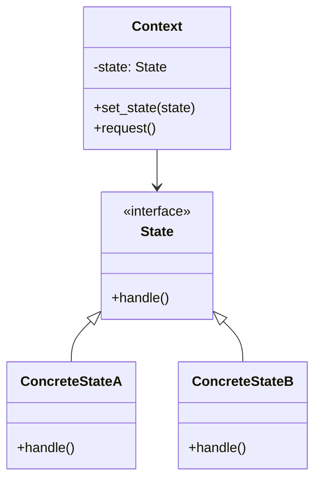

# State Pattern

State 패턴은 객체의 내부 상태에 따라 행동을 바꾸는 구조 디자인 패턴입니다.  
즉, 조건문(if/else) 대신 상태 객체를 분리하여, 상태 전환과 행동을 깔끔하게 관리할 수 있습니다.

## 🐍 Python 예제 (State 패턴)
```python
class State:
    def handle(self):
        raise NotImplementedError

class ConcreteStateA(State):
    def handle(self):
        print("State A: Handling request, switching to State B")

class ConcreteStateB(State):
    def handle(self):
        print("State B: Handling request, switching to State A")

class Context:
    def __init__(self, state: State):
        self.state = state

    def set_state(self, state: State):
        self.state = state

    def request(self):
        self.state.handle()
```
```python
def main():
    # 초기 상태는 A
    context = Context(ConcreteStateA())

    # 상태 전환 시뮬레이션
    context.request()   # State A 동작
    context.set_state(ConcreteStateB())
    context.request()   # State B 동작
    context.set_state(ConcreteStateA())
    context.request()   # 다시 State A 동작

if __name__ == "__main__":
    main()
```


## 🧠 이 예제에서의 역할

| 역할       | 클래스                     | 설명                          |
|------------|----------------------------|-------------------------------|
| State      | State                      | 상태 인터페이스 정의           |
| Concrete   | ConcreteStateA, ConcreteStateB | 실제 상태별 동작 구현         |
| Context    | Context                    | 현재 상태를 보관하고 요청 위임 |
| Client     | main()                     | 상태 전환 및 요청 실행         |


## 🗺️ State 패턴 클래스 다이어그램


## ✅ 요약
- State 패턴은 객체의 상태를 클래스로 분리하여, 상태 전환과 행동을 관리합니다.
- Context는 현재 상태를 보관하고, 클라이언트 요청을 상태 객체에 위임합니다.
- 조건문 없이 상태 전환을 유연하게 처리할 수 있어 코드 가독성과 유지보수성이 좋아집니다.
- 이 패턴은 게임 캐릭터 상태 관리(Idle, Attack, Dead), 네트워크 연결 상태(Open, Closed, Error),  
  UI 위젯 상태(Enabled, Disabled, Hover) 등에서 자주 활용됩니다.

---

