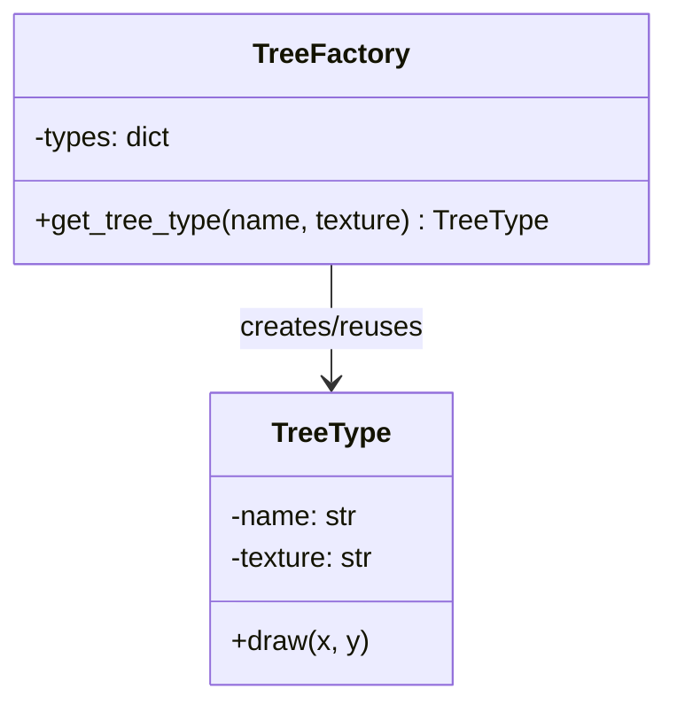

## 🧩 Flyweight 패턴이란?
- 목적: 메모리 사용을 줄이고 성능을 높이기 위해, **공유 가능한 객체(내부 상태)** 를 캐싱하여 재사용하는 패턴입니다.
- 핵심 아이디어:
  - 객체의 내부 상태(intrinsic state): 공유 가능한 불변 데이터 (예: 나무 종류, 텍스처).
  - 객체의 외부 상태(extrinsic state): 개별적으로 달라지는 데이터 (예: 위치 좌표).
  - 동일한 내부 상태를 가진 객체는 한 번만 생성하고, 여러 곳에서 재사용합니다.

### 🐍 예제 설명
```python
tree1 = factory.get_tree_type("Oak", "Green")
tree2 = factory.get_tree_type("Oak", "Green")
```

- TreeFactory는 "Oak"+"Green" 키를 기준으로 TreeType 객체를 캐싱합니다.
- tree1과 tree2는 같은 객체를 참조합니다. (메모리 절약)
- draw(x, y) 호출 시 위치 좌표는 외부 상태로 전달됩니다.

### 출력:
```
Drawing Oak with texture Green at (10, 20)
Drawing Oak with texture Green at (30, 40)
```

## 🧠 이 예제에서의 역할

| 역할       | 클래스       | 설명                                   |
|------------|--------------|----------------------------------------|
| Flyweight  | TreeType     | 공유 가능한 내부 상태(name, texture) 관리 |
| Factory    | TreeFactory  | Flyweight 객체 생성 및 캐싱, 재사용 관리 |
| Client     | main 코드    | 외부 상태(x, y 좌표)를 전달하여 객체 사용 |

## 🐍 Python 버전
```python
class TreeType:
    def __init__(self, name, texture):
        self.name = name
        self.texture = texture

    def draw(self, x, y):
        print(f"Drawing {self.name} with texture {self.texture} at ({x}, {y})")

class TreeFactory:
    def __init__(self):
        self.types = {}

    def get_tree_type(self, name, texture):
        key = name + texture
        if key not in self.types:
            self.types[key] = TreeType(name, texture)
        return self.types[key]

factory = TreeFactory()
tree1 = factory.get_tree_type("Oak", "Green")
tree2 = factory.get_tree_type("Oak", "Green")

tree1.draw(10, 20)
tree2.draw(30, 40)
```

## 🗺️ Flyweight 패턴 클래스 다이어그램

## ✅ 요약
- Flyweight 패턴은 공유 가능한 불변 상태를 캐싱하여 메모리 사용을 줄입니다.
- 이 예제에서는 "Oak"+"Green" 텍스처를 가진 나무 타입을 한 번만 생성하고, 여러 좌표에서 재사용합니다.
- 게임 개발(수많은 나무, 총알, 파티클), GUI 아이콘, 텍스트 렌더링 등 대량 객체 관리에 자주 활용됩니다.

---

