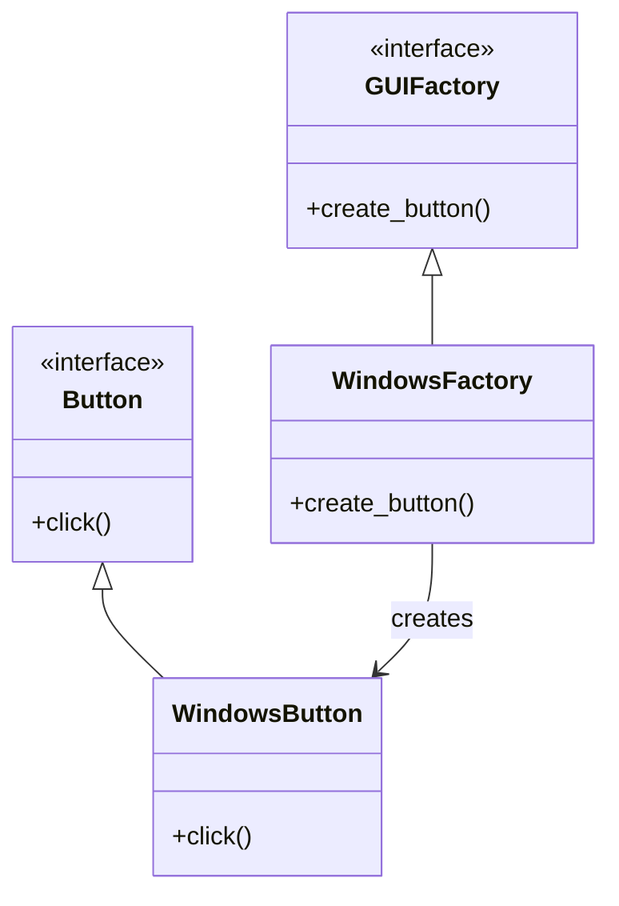

## 🧩 Abstract Factory 패턴이란?
- 목적: 관련된 객체들의 집합(제품군)을 생성하는 인터페이스를 제공하면서, 구체적인 클래스는 지정하지 않고 사용할 수 있게 해주는 패턴입니다.
- 핵심 아이디어:
  - 클라이언트는 추상 팩토리 인터페이스만 알고, 실제 어떤 구체 클래스가 생성되는지는 모릅니다.
  - 이를 통해 플랫폼 독립성과 제품군 일관성을 유지할 수 있습니다.

## 🐍 예제 설명 
- 클래스 역할  


| 역할              | 클래스              | 주요 기능/메서드       |
|-------------------|---------------------|------------------------|
| Product 인터페이스 | Button              | click()                |
| Concrete Product   | WindowsButton       | Windows 버튼 구현       |
| Abstract Factory   | GUIFactory          | create_button()        |
| Concrete Factory   | WindowsFactory      | WindowsButton 생성      |
| Client             | factory = WindowsFactory() | 팩토리를 통해 버튼 생성 및 사용 |

- 실행 흐름
  - 클라이언트는 GUIFactory 인터페이스만 알고 있습니다.
  - 실제로는 WindowsFactory를 사용하여 WindowsButton을 생성합니다.
  - 클라이언트는 버튼을 생성하고 click()을 호출합니다.
  - 결과: "Windows 버튼 클릭!" 출력.

## 🐍 Python 예시
```python
class Button(metaclass=ABCMeta):
    @abstractmethod
    def click(self): pass

class WindowsButton(Button):
    def click(self): print("Windows 버튼 클릭!")

class GUIFactory(metaclass=ABCMeta):
    @abstractmethod
    def create_button(self): pass

class WindowsFactory(GUIFactory):
    def create_button(self): return WindowsButton()

# 클라이언트
factory = WindowsFactory()
button = factory.create_button()
button.click()
```

## 🗺️ Abstract Factory 클래스 다이어그램



## ✅ 장점
- 플랫폼 독립성: 클라이언트는 어떤 버튼이 생성되는지 몰라도 됨.
- 제품군 일관성: 같은 팩토리에서 생성된 객체들은 서로 호환됨.
- 확장성: 새로운 OS나 GUI 환경이 추가되면, 해당 팩토리와 제품만 추가하면 됨.
## ⚠️ 단점
- 클래스 수가 많아져서 구조가 복잡해질 수 있음.
- 단순한 경우에는 오히려 과도한 설계가 될 수 있음.

## 용도
- 👉 이 예제를 확장하면 MacFactory, LinuxFactory 같은 팩토리를 추가하고, 각각 MacButton,  
  LinuxButton을 생성하도록 만들 수 있습니다.  
- 이렇게 하면 클라이언트는 GUIFactory 인터페이스만 사용하면서 다양한 플랫폼에 대응할 수 있게 됩니다.
