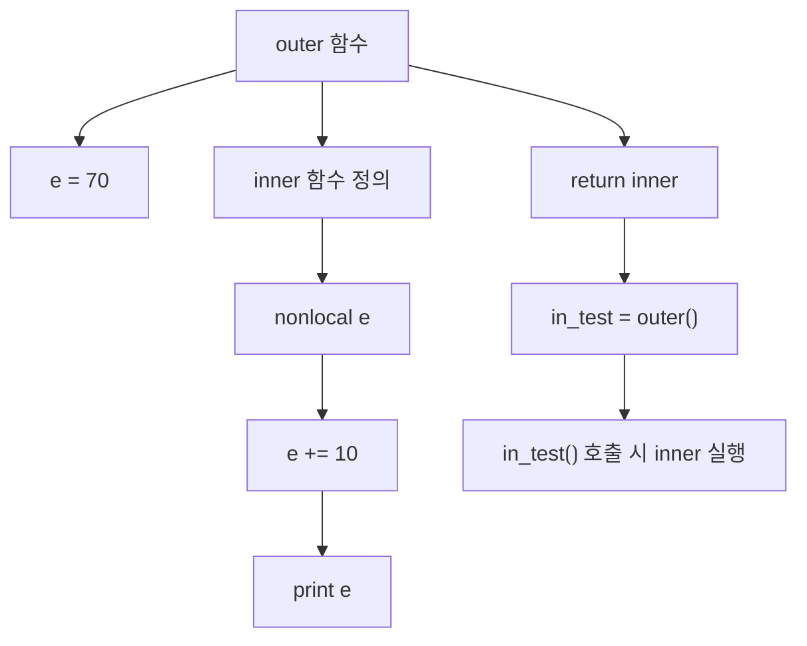

# nonlocal과 Closure

## 🧠 핵심 개념: nonlocal과 클로저

### 🔍 클로저(Closure)란?
- 함수 내부에 정의된 **내부 함수(inner function)** 가
- 외부 함수의 지역 변수를 참조하거나 수정할 수 있는 구조
- 내부 함수가 외부 함수의 실행 컨텍스트를 기억하고 있음

### 🔧 nonlocal 키워드란?
- 내부 함수에서 외부 함수의 지역 변수를 수정할 때 사용
- 기본적으로 Python은 내부 함수에서 값을 할당하면 지역 변수로 간주
- nonlocal을 선언하면 외부 함수의 변수임을 명시함

### ⚠️ 오류 발생 원인
```python
def outer():
    e = 70
    def inner():
        e += 10  # ❌ 지역 변수로 간주되어 UnboundLocalError 발생
        print('Ex5 > ', e)
    return inner
```

- e += 10은 사실상 e = e + 10이므로 **할당(assign)** 이 발생
- Python은 이를 지역 변수 e로 간주하지만, 초기화되지 않았기 때문에 오류 발생

### ✅ 해결 방법: `nonlocal` 선언
```python
def outer():
    e = 70
    def inner():
        nonlocal e  # ✅ 외부 함수의 지역 변수 e를 수정하겠다고 명시
        e += 10
        print('Ex5 > ', e)
    return inner
```

- `nonlocal` 을 사용하면 내부 함수에서 외부 함수의 지역 변수 e를 수정 가능
- 클로저가 외부 컨텍스트를 기억하고 유지하기 때문에 호출할 때마다 누적됨

### 🧪 실행 결과
```python
in_test = outer()
in_test()  # Ex5 > 80
in_test()  # Ex5 > 90
in_test()  # Ex5 > 100
in_test()  # Ex5 > 110
```

- e는 외부 함수의 지역 변수지만, 클로저에 의해 내부 함수가 계속 접근 가능
- nonlocal 덕분에 값이 누적됨

### 🧠 실무에서 왜 중요한가?

| 상황 또는 목적             | 설명                                                                 |
|----------------------------|----------------------------------------------------------------------|
| 클로저 기반 상태 저장       | 함수 내부에서 외부 변수의 상태를 유지하며 누적하거나 제어 가능               |
| 데코레이터 구현             | 내부 함수가 외부 변수에 접근해 동작을 제어할 때 `nonlocal`이 필수             |
| 함수형 설계                 | 객체 없이도 함수만으로 상태를 관리하거나 동작을 캡슐화할 수 있음              |
| 테스트 및 캡슐화            | 외부 변수 노출 없이 내부에서만 상태를 유지하므로 보안성과 테스트 용이성 향상   |
| 고차 함수 구현              | 동적으로 생성된 함수들이 외부 컨텍스트를 기억하고 활용할 수 있음              |


### 📊 nonlocal 다이어그램



### ✅ 요약
- nonlocal은 내부 함수에서 외부 함수의 지역 변수를 수정할 때 필요
- 클로저는 함수가 자신이 정의된 환경을 기억하는 구조
- 실무에서는 데코레이터, 상태 저장 함수, 고차 함수 구현 등에 매우 유용

---

## glbal과 nonlocal

- 함수 내부에서 어떤 변수를 수정하려고 할 때, 그 변수가 **전역 변수(global)** 인지, **외부 함수의 지역 변수(nonlocal)** 인지,    
    아니면 **자기 자신의 지역 변수(local)** 인지에 따라 Python의 해석 방식이 달라짐.

### 🔍 왜 global이 아닌가?
```python
def outer():
    e = 70
    def inner():
        e += 10  # 여기서 e는 outer의 지역 변수
```

- inner()는 outer() 내부에 정의된 **중첩 함수(closure)**
- e는 outer()의 지역 변수이지, 전역 변수가 아님
- 따라서 inner()에서 e를 수정하려면 `global` 이 아니라 `nonlocal` 을 써야 함

### 🔑 키워드 선택 기준

| 키워드       | 대상 변수 위치               | 사용 목적                          | 예시 상황                          |
|--------------|------------------------------|------------------------------------|-------------------------------------|
| `global`     | 모듈 전체의 전역 변수         | 함수 내부에서 전역 변수 수정 시 사용 | `global x` → 전역 x에 값 할당        |
| `nonlocal`   | 바로 바깥 함수의 지역 변수     | 중첩 함수에서 외부 지역 변수 수정 시 사용 | 클로저 내부에서 외부 변수 누적        |
| 없음         | 현재 함수의 지역 변수         | 함수 내부에서 새 변수 정의 및 수정   | `x = 10` → 지역 변수 x 생성          |

### 🧠 실무 팁
- global은 전역 상태를 바꾸기 때문에 테스트나 모듈화에 불리
- nonlocal은 클로저 기반 상태 저장이나 데코레이터 구현에 매우 유용
- 둘 다 명시적으로 선언해야만 수정 가능하다는 점이 중요해

---
#  클러저 설명

## 🧠 클로저(Closure)란?
- 클로저는 함수가 자신이 정의된 환경(스코프)을 기억하고, 그 환경의 변수에 접근할 수 있는 구조.  
- 즉, 함수가 **자신의 외부 컨텍스트를 캡처(capture)** 해서, 그 컨텍스트가 사라진 이후에도 계속 사용할 수 있게 해주는 기능.

- Python에서 함수가 클로저(Closure)가 되기 위한 🔑 조건을 정리한 표. 
- 단순히 중첩 함수라고 해서 클로저가 되는 건 아니고, 특정한 구조와 동작이 충족되어야 함:

### 🔑 클로저가 되기 위한 조건
| 조건 항목           | 설명                                                                 |
|----------------------|----------------------------------------------------------------------|
| 중첩 함수 존재        | 함수 내부에 또 다른 함수가 정의되어 있어야 함                          |
| 외부 지역 변수 참조    | 내부 함수가 외부 함수의 지역 변수에 접근해야 함                         |
| 외부 함수가 반환됨    | 외부 함수가 내부 함수를 반환하여, 외부 함수 실행 이후에도 내부 함수가 살아 있어야 함 |
| 실행 컨텍스트 유지     | 내부 함수가 외부 함수의 실행 환경을 기억하고 계속 사용할 수 있어야 함       |

- 이 표는 클로저가 단순한 중첩 함수가 아니라, 환경을 기억하고 상태를 유지하는 함수 객체라는 걸 명확히 보여줌. 

### 🧪 예제: 클로저의 본질
```python
def outer():
    count = 0
    def inner():
        nonlocal count
        count += 1
        return count
    return inner

counter = outer()
print(counter())  # 1
print(counter())  # 2
print(counter())  # 3
```

- inner()는 outer()의 지역 변수 count를 기억하고 있음
- outer()는 이미 종료됐지만, count는 inner() 내부에서 계속 유지됨
- 이게 바로 클로저의 핵심: 환경을 기억하는 함수

---


